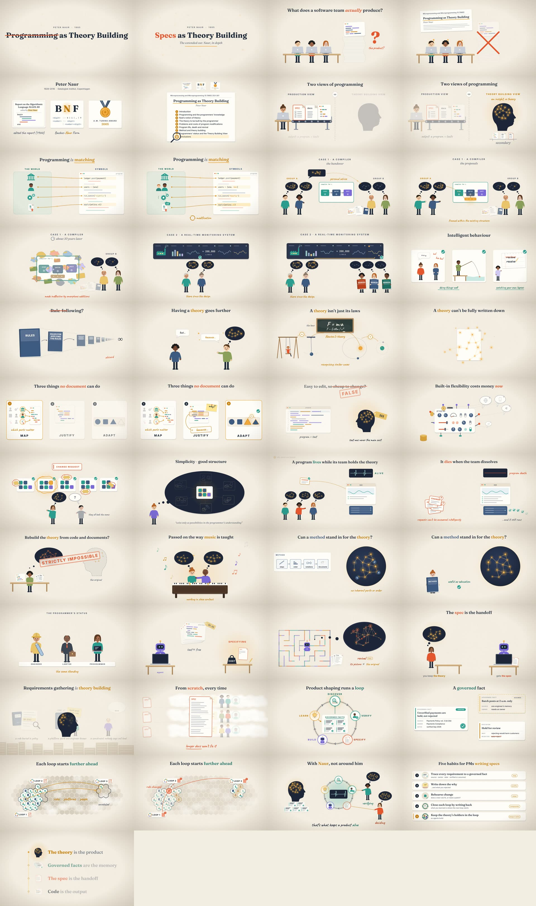

# Specs as Theory Building

Two animated explainers about Peter Naur's 1985 essay **"Programming as Theory Building."** They cover what Naur actually argued and why the argument now applies to **specs**, the main input to agentic coding. They are aimed at product managers gathering requirements in regulated, hard-to-map enterprise environments.

| | The 90-second cut | The extended cut (about 6 min) |
|---|---|---|
| ▶ Video | [`out/specs-as-theory-building.mp4`](out/specs-as-theory-building.mp4) ([`.srt`](out/specs-as-theory-building.srt)) | [`out/specs-as-theory-building-extended.mp4`](out/specs-as-theory-building-extended.mp4) ([`.srt`](out/specs-as-theory-building-extended.srt)) |
| 📝 Script, with Naur's words and page numbers | [`script.md`](videos/specs-as-theory-building/script.md) | [`script.md`](videos/specs-as-theory-building-extended/script.md) |
| 🎞 Storyboard | [`storyboard/`](videos/specs-as-theory-building/storyboard/README.md) | [`storyboard/`](videos/specs-as-theory-building-extended/storyboard/README.md) · [plan](videos/specs-as-theory-building-extended/storyboard-plan.md) |
| What it covers | The thesis, the three abilities, the compiler case, agents, the enterprise, four habits | Every section of the essay in turn (both field cases, Ryle, Newton, modification cost, decay, life and death, method, status), then **loops that write back governed facts** so each later spec starts with fewer unknowns, and five habits |

Both are 1920×1080 at 30 fps with captions embedded. Every frame, sound and caption is generated from the code in this repo.

🛠 **Make another one:** [`docs/playbook.md`](docs/playbook.md) · [`docs/engine.md`](docs/engine.md) · [`docs/behind-the-scenes.md`](docs/behind-the-scenes.md)



## The argument in one breath

Naur says a program's real product is not its text. It is the **theory** its programmers hold: knowing how the program handles its part of the world, and being able to *explain*, *justify* and *adapt* it. Documents, including specifications, can't carry that theory, and a program whose theory-holders are gone is dead even while it runs. Agents now make text nearly free, but for Naur text was never the expensive part. So the scarce work moves to **specifying**. Writing the spec is how a PM builds the theory, the spec is what the agent receives, and the theory stays with the people who built it.

The extended cut adds a way to make that work compound. Each piece of product shaping runs a loop: discover, verify with the people who own the facts, specify, build with agents, and learn. It then writes back what it learned as **governed facts**: each one cites a source, names an owner, carries a date, and says whether it is verified or still assumed. The next loop, whether it is adjacent or unrelated, starts from those facts, so it has fewer unknown rules to resolve and its remaining effort goes to the questions that need judgment. Facts are not the theory, which is why the loop keeps the people who hold it in charge of verifying and deciding.

### Takeaways for PMs

1. **Trace every requirement to a governed fact**: its source, owner and date, and whether it is verified or assumed. This is Naur's *map*.
2. **Write down the why**, plus what you rejected and the reason. This is Naur's *justify*.
3. **Rehearse change.** Would a likely new rule fit the design, or need a patch? This is Naur's *adapt*.
4. **Close each loop by writing back what you learned**, so the next loop starts ahead.
5. **Keep the theory's holders in the loop** as agents build. This keeps the product alive.

## How it was made

Everything is generated from source in this repo: script, voice, timing, illustration, animation, sound and captions. Each video lives in its own folder under `videos/<slug>/`, and the kit around it is shared.

| Step | File | What it does |
|---|---|---|
| Script | `videos/<slug>/narration.json` | Single source of truth. The `{cue}` markers tie visual beats to specific words. |
| Voice | `pipeline/tts.py` | Synthesizes each line through **OpenRouter's** `/api/v1/audio/speech`, or a local stand-in |
| Alignment | `pipeline/align.py` | Uses faster-whisper word timestamps so animation beats land on words for any voice |
| Timeline | `pipeline/timeline.py` | Lays out lines, scenes and chapters on one clock, and exports captions |
| Animation | `video/*.js` + `videos/<slug>/scenes*.js` | A small immediate-mode SVG motion-graphics engine and illustration library, plus each video's choreography. Every frame is a pure function of time and illustrations are hand-coded vectors. |
| Frames | `video/render.js` | Headless Chromium via Playwright renders every frame at 1080p (about 11,000 for the extended cut) |
| Sound | `pipeline/mix.py` | Procedural music bed and cue-synced sound effects, ducked under the narration |
| Encode | `pipeline/encode.py` | H.264 and AAC, loudness-normalized to −16 LUFS, soft subtitles |
| Storyboard | `pipeline/storyboard.py` | Keyframes, contact sheet and `storyboard/README.md`, taken from the actual cut |
| Review | `tools/review.py` | Labelled 4×4 contact sheets of cues, transitions, the whole cut, or the encoded MP4, for visual QA without watching |
| Page | `publish/page.py` + `videos/<slug>/page.html` | Web encode, poster, keyframes and a filled page in `build/<slug>/page/`, ready to publish as an Artifact |

Build a video with `VIDEO=<slug> ./build.sh` (for example `VIDEO=specs-as-theory-building-extended ./build.sh`). To preview in a browser, run `python3 -m http.server` from the repo root, then open `http://localhost:8000/video/index.html?video=<slug>`. That gives a scrubbable player that plays `build/<slug>/mix.wav` in sync.

## Voiceover: OpenRouter

The pipeline calls OpenRouter's text-to-speech endpoint (OpenAI-compatible, `POST /api/v1/audio/speech`). By default it uses **`google/gemini-3.8-flash-tts`** with voice **`Charon`** and a style prompt ("a warm, curious science-explainer narrator…") passed through `provider.options.google-ai-studio.speech_metadata`.

> **Status of the current cuts:** both were rendered **without** an OpenRouter key, because none was available in the build environment. The narration is a local stand-in, [`hexgrad/Kokoro-82M`](https://huggingface.co/hexgrad/Kokoro-82M) (voice `af_heart`). OpenRouter also hosts that model as `hexgrad/kokoro-82m`. The end card credits whichever voice was used.

To render with an OpenRouter voice:

```bash
export OPENROUTER_API_KEY=...            # or store it in your environment's secrets
./setup.sh                               # once: ffmpeg, espeak-ng, Python deps, Chromium
VIDEO=specs-as-theory-building ./build.sh   # uses OpenRouter automatically when the key is set
# other voices / models:
VIDEO=specs-as-theory-building VOICE=openrouter ./build.sh --voice Sadaltager
VIDEO=specs-as-theory-building VOICE=openrouter ./build.sh --model microsoft/mai-voice-2 --voice "en-US-Harper:MAI-Voice-2" --provider-options '{"azure":{"style":"cheerful"}}'
VIDEO=specs-as-theory-building VOICE=openrouter ./build.sh --model hexgrad/kokoro-82m --voice af_heart --style ""   # the stand-in voice, via OpenRouter
```

Timing adapts automatically. Each line is re-aligned, so the animation re-times itself to the new voice. A slower voice makes the video longer. The stand-in speaks at about 180 wpm; at that pace the short cut runs 90 s and the extended cut 6 min 5 s. A hosted voice at about 155 wpm would stretch the extended cut to about 7 min.

## Reusing the kit

This repo is also a reusable kit. To make another explainer, follow [`docs/playbook.md`](docs/playbook.md): preflight, research, script, voice, storyboard, scenes, render, QA, ship, with a quality gate for each phase. [`docs/engine.md`](docs/engine.md) documents the animation API and the recipes the scenes use. [`docs/behind-the-scenes.md`](docs/behind-the-scenes.md) is the retrospective: decisions, what went well, and every problem hit and how it was fixed, including what changed for a six-minute video built by parallel agents. Coding agents also get [`CLAUDE.md`](CLAUDE.md) and the `explainer-video` skill in `.claude/skills/`.

## Sources

- Peter Naur, "Programming as Theory Building," *Microprocessing and Microprogramming* 15 (1985): 253–261. Invited keynote at Euromicro 84. It is reprinted in Naur, *Computing: A Human Activity* (1992).
- Gilbert Ryle, *The Concept of Mind* (1949).

## Credits and licences

Fonts: Fraunces, Inter, JetBrains Mono and Caveat (SIL Open Font License; see `video/fonts/LICENSE-*.txt`). Stand-in voice: Kokoro-82M (Apache-2.0). Alignment: faster-whisper (MIT). All illustrations, animation, music and sound effects are generated by the code in this repository.
