# Storyboard: *Specs as Theory Building*

19 beats across 90 seconds. Keyframes are exported from the rendered video (`python pipeline/storyboard.py`), so they always match the current cut.

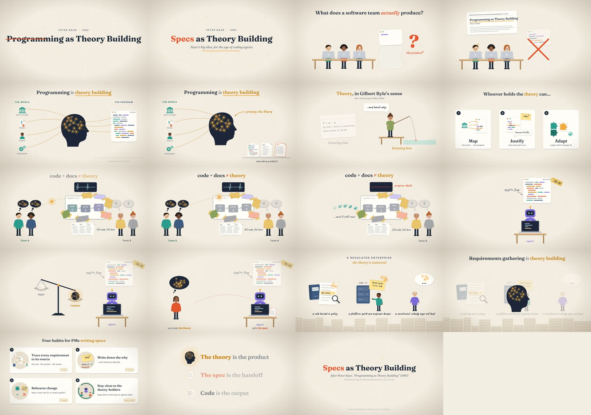

### 1. title (0:01.2)

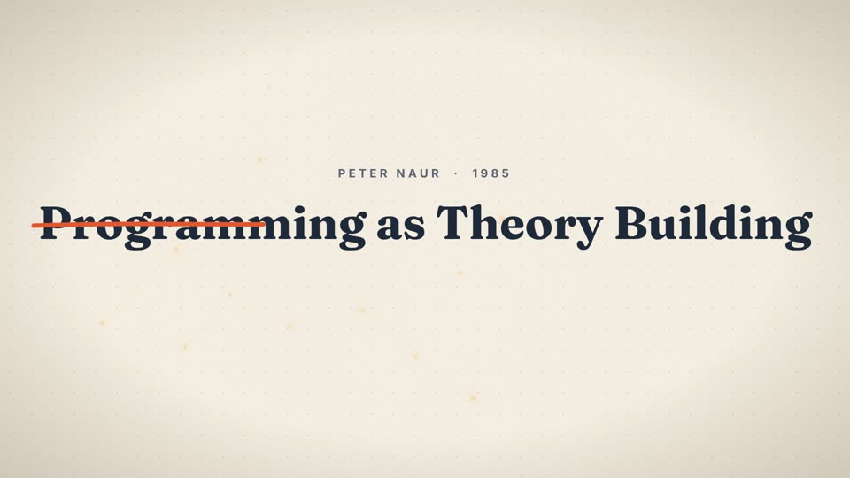

Naur's title is struck out: *Programming* becomes **Specs**.

### 2. title (0:03.0)

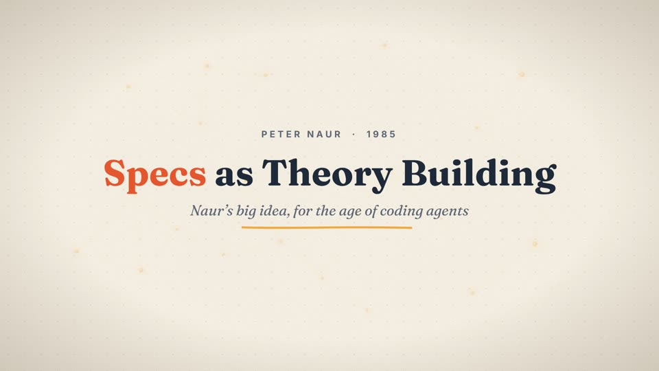

Title card: *Specs as Theory Building*, Naur's big idea for the age of coding agents.

### 3. hook (0:05.6)

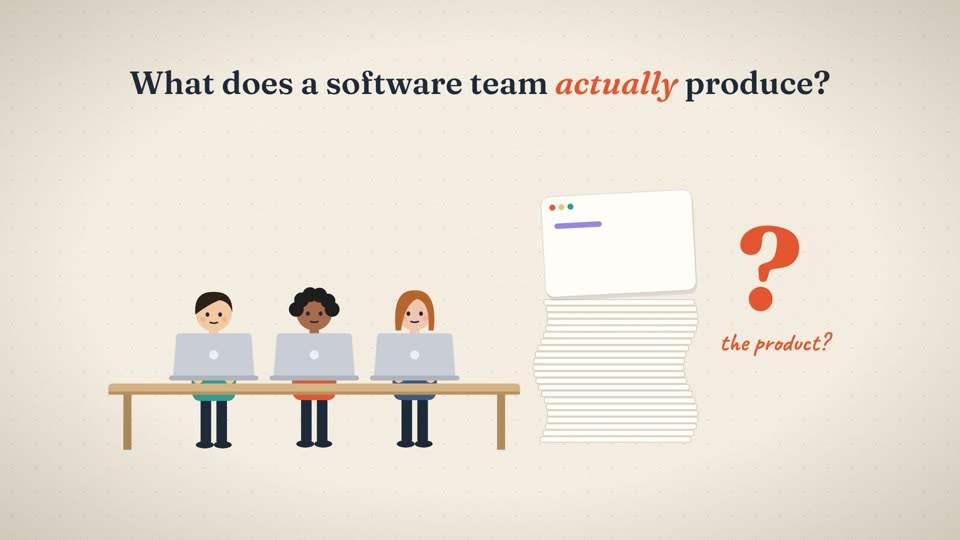

"What does a software team *actually* produce?" A team at laptops builds a tall stack of printouts. *The product?*

> 🎙 *What does a software team actually produce?*

### 4. hook (0:10.2)

Naur's 1985 paper answers: **not the code.** The stack is crossed out and sparks appear over the team's heads.

> 🎙 *In 1985, Peter Naur's surprising answer: not the code.*

### 5. thesis (0:17.2)

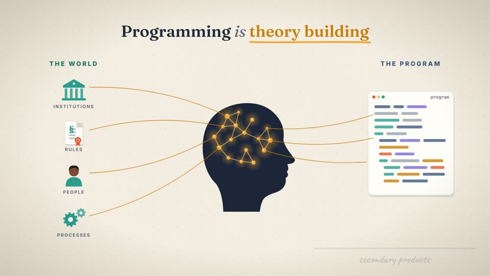

Programming is theory building. THE WORLD (institutions, rules, people, processes) is mapped through a theory, drawn as a constellation in the head, to THE PROGRAM.

> 🎙 *Programming, he argued, is theory building: working out how part of the world will be handled by a program. Code and documents, even specs, come second.*

### 6. thesis (0:19.6)

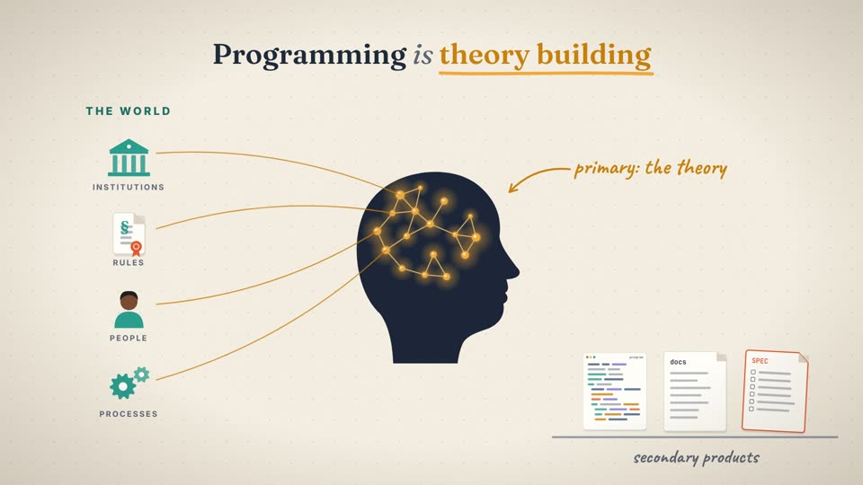

Code, docs and even the SPEC drop onto a shelf of *secondary products*. *Primary: the theory.*

> 🎙 *Code and documents, even specs, come second.*

### 7. ryle (0:24.5)

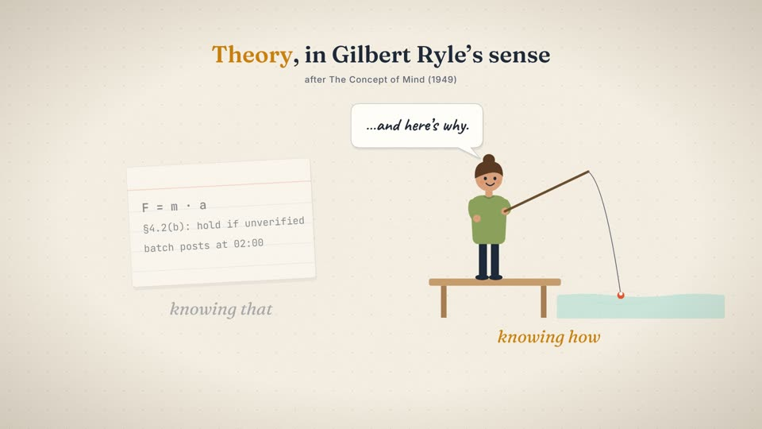

Theory in Gilbert Ryle's sense. *Knowing that* is a card of facts. *Knowing how* is doing it (casting a line) and being able to explain why.

> 🎙 *It's theory in Gilbert Ryle's sense: knowing how, and being able to explain it.*

### 8. ryle (0:30.5)

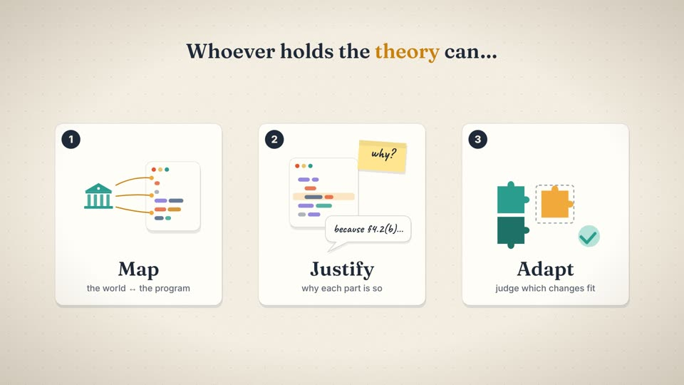

Whoever holds the theory can **Map** the world to the program, **Justify** each part, and **Adapt**: judge which changes fit.

> 🎙 *Whoever holds it can map the program to the world, justify each part, and judge which changes fit.*

### 9. compiler (0:37.7)

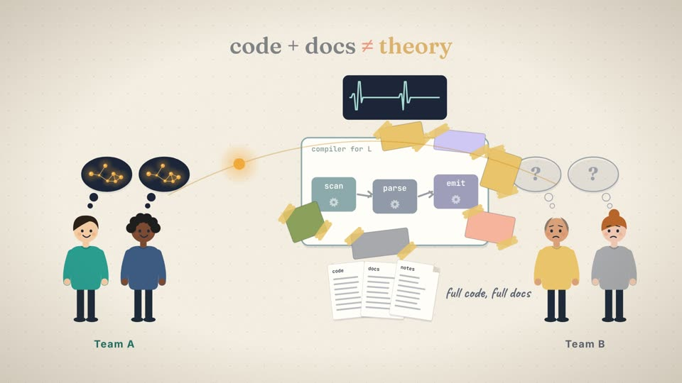

Naur's case: Team B inherits a compiler with full code and docs. Their extensions are taped-on patches that break its design.

> 🎙 *Naur saw a team inherit a compiler, with full code and full docs, and still patch its design apart. The theory didn't travel.*

### 10. compiler (0:38.1)

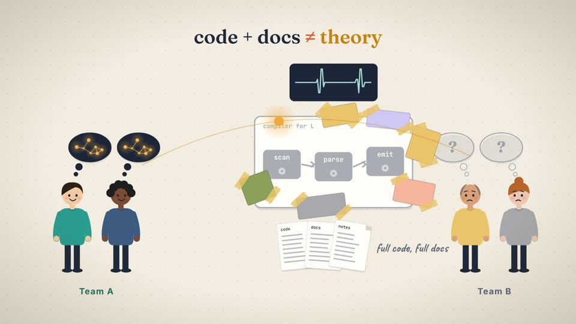

The theory tries to travel to Team B and can't: **code + docs ≠ theory.**

> 🎙 *Naur saw a team inherit a compiler, with full code and full docs, and still patch its design apart. The theory didn't travel.*

### 11. compiler (0:42.8)

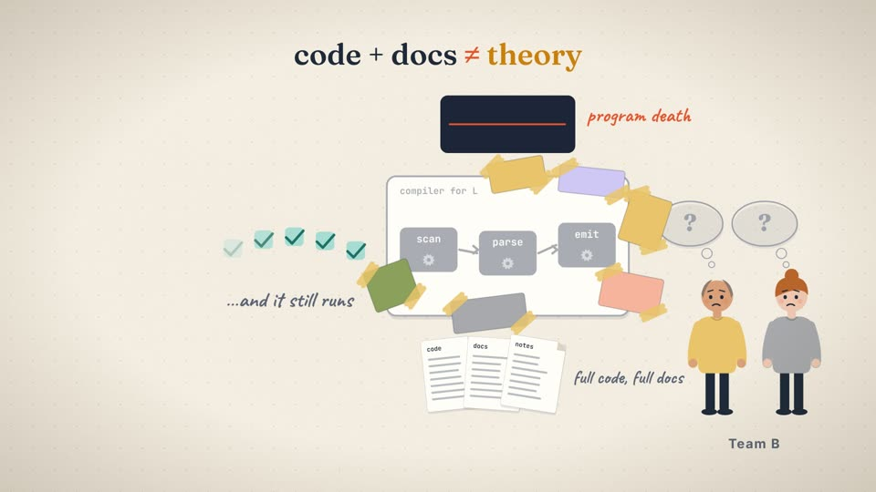

Team A leaves and the monitor flatlines: *program death*. The program still runs, but nobody can change it intelligently.

> 🎙 *And when its holders leave, a program dies, even while it still runs.*

### 12. agents (0:46.8)

Now agents write the code. Text is nearly free: **$0.00**.

> 🎙 *Now agents write the code. Text is nearly free. But for Naur, text was never the expensive part. The theory is.*

### 13. agents (0:50.7)

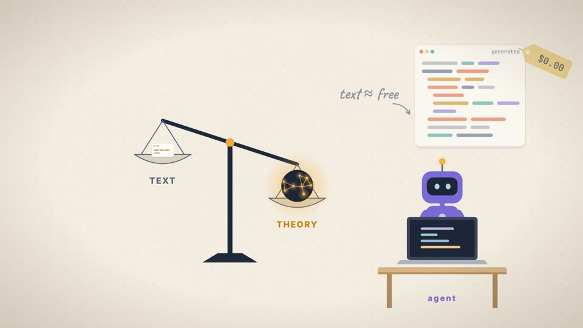

For Naur, text was never the expensive part. The scale tips toward THEORY.

> 🎙 *Text is nearly free. But for Naur, text was never the expensive part. The theory is. And specifying is how you build it.*

### 14. agents (0:55.4)

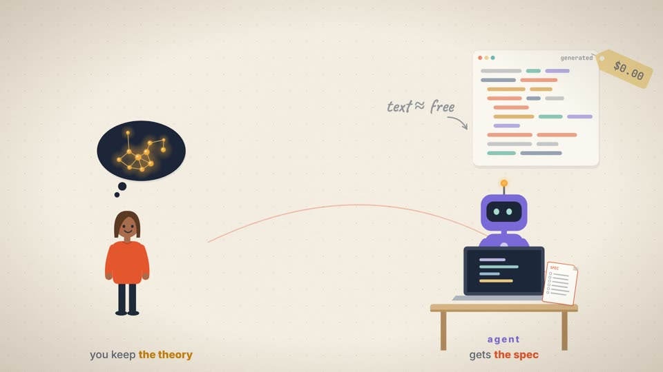

Specifying builds the theory. The agent **gets the spec** and **you keep the theory**.

> 🎙 *And specifying is how you build it. The agent gets your spec. You keep the theory.*

### 15. enterprise (1:05.3)

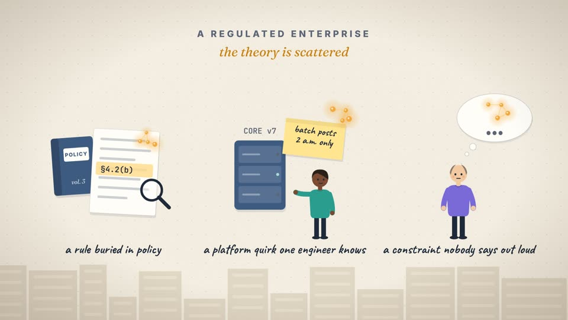

A regulated enterprise: the theory is scattered across a rule buried in policy, a platform quirk one engineer knows, and a constraint nobody says out loud.

> 🎙 *In a regulated enterprise, that theory is scattered: a rule buried in policy, a platform quirk one engineer knows, a constraint nobody says out loud.*

### 16. enterprise (1:08.2)

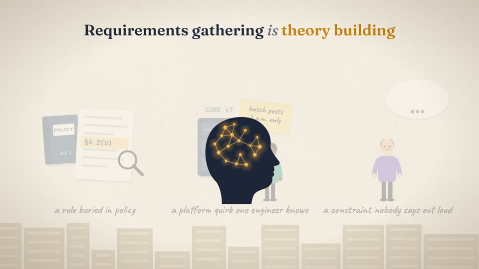

Requirements gathering *is* theory building. The fragments come together in one head.

> 🎙 *In a regulated enterprise, that theory is scattered: a rule buried in policy, a platform quirk one engineer knows, a constraint nobody says out loud. Requirements gathering is theory building.*

### 17. takeaways (1:21.0)

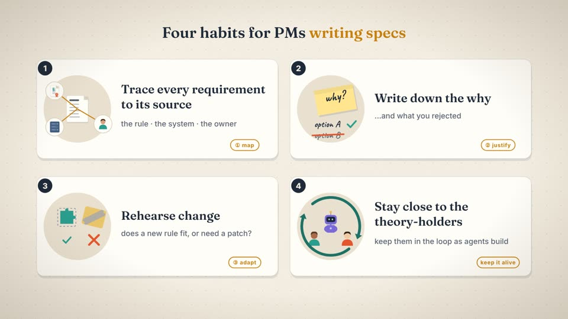

Four habits: trace to source (map), write down the why (justify), rehearse change (adapt), and stay close to the theory-holders (keep it alive).

> 🎙 *And sit with the people who hold the theory. Keep them in the loop as agents build.*

### 18. close (1:26.6)

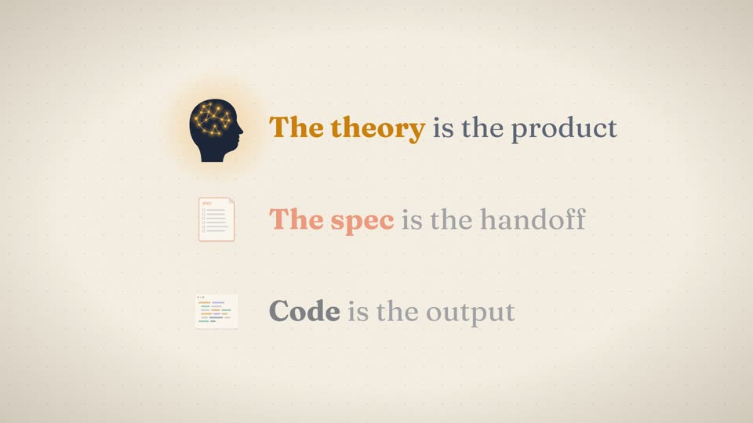

Code is the output. The spec is the handoff. **The theory is the product.**

> 🎙 *Code is the output. The spec is the handoff. The theory is the product.*

### 19. end (1:28.7)

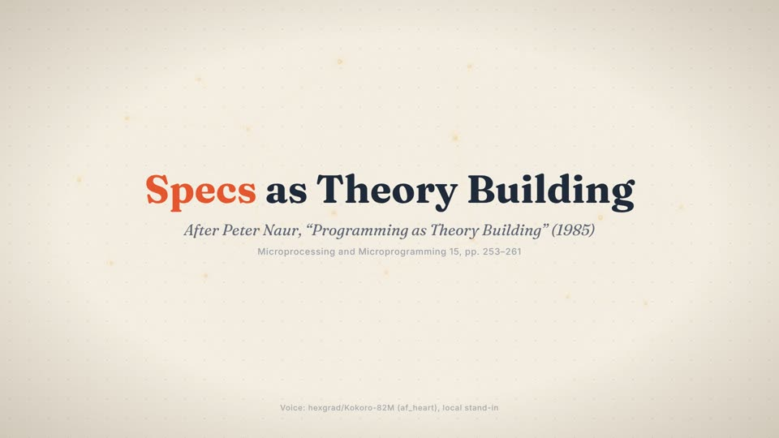

End card with the citation and voice credit.

---

**Visual language.** Warm paper, ink-navy line art and three accent colours. Gold means *theory* (the constellation), coral means *the spec and critique marks*, and teal means *the world*. Type is Fraunces for statements, Inter for labels and Caveat for handwritten asides. The recurring motif is the theory drawn as a constellation. It lives inside people's heads, it can't be copied across with documents, and it glows wherever a human really understands the system.
