# Storyboard: *Specs as Theory Building: Extended Cut*

45 beats across 365 seconds. Keyframes are exported from the rendered video (`python pipeline/storyboard.py`), so they always match the current cut.

### 1. title (0:01.3)

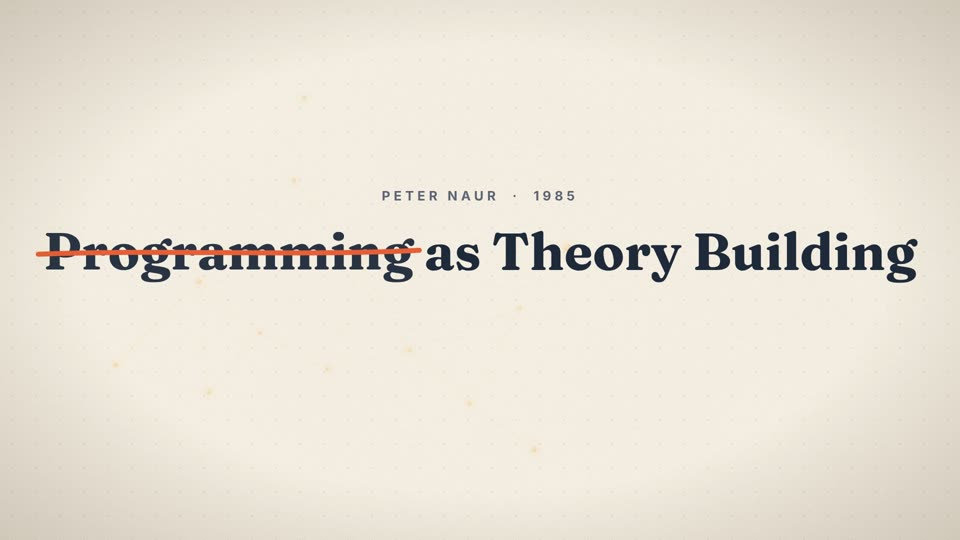

Naur's title is struck out: *Programming* becomes **Specs**.

### 2. title (0:03.2)

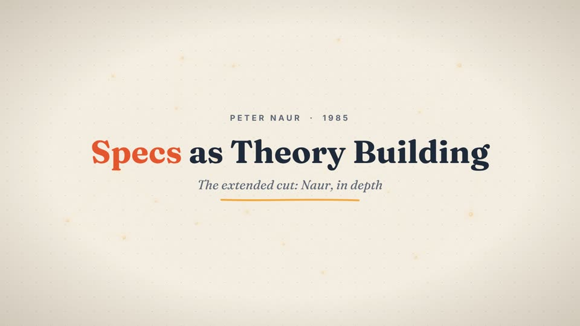

Title card: *Specs as Theory Building*, the extended cut.

### 3. hook (0:08.1)

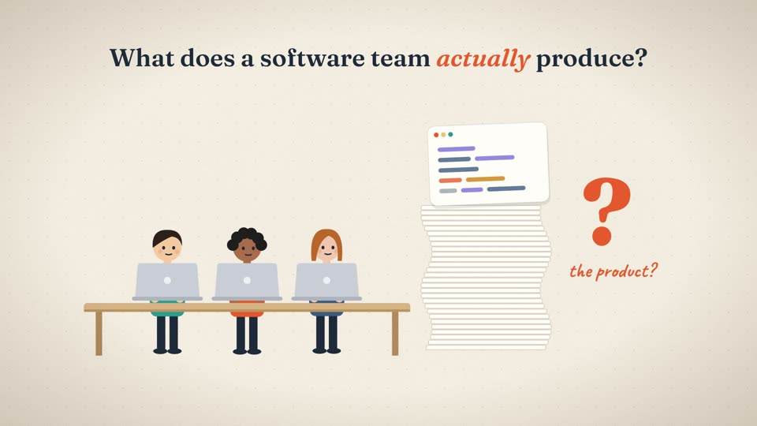

"What does a software team *actually* produce?" The team's printouts pile up. *The product?*

> 🎙 *What does a software team actually produce? Code, surely. Piles of it.*

### 4. hook (0:11.9)

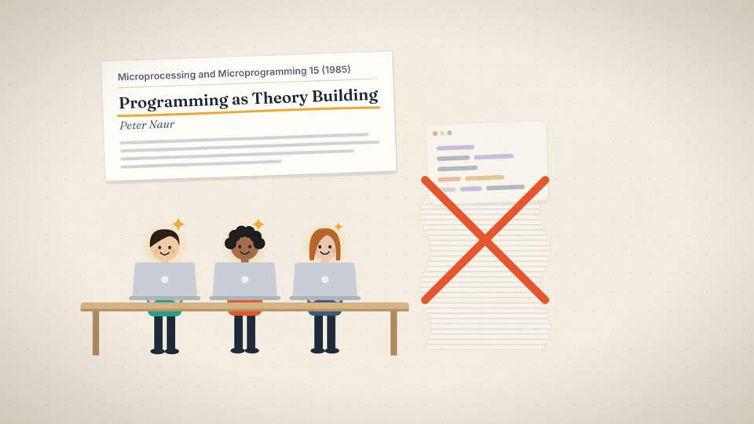

Naur's 1985 answer: **not the code.** The stack is crossed out and sparks rise over the team.

> 🎙 *In 1985, Peter Naur's answer was not the code.*

### 5. naur (0:17.9)

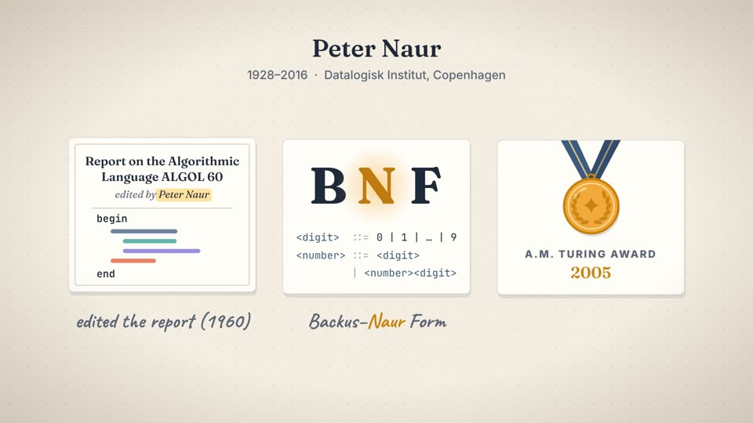

Peter Naur: editor of the **ALGOL 60** report, the **N in BNF**, **Turing Award** 2005.

> 🎙 *Naur edited the ALGOL 60 report, is the N in BNF, and won the Turing Award. His essay, Programming as Theory Building, rewards a slower look.*

### 6. naur (0:21.8)

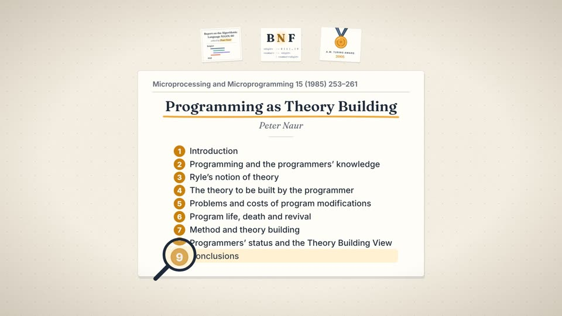

The essay's own sections, read slowly. The chapters of this cut follow them.

> 🎙 *His essay, Programming as Theory Building, rewards a slower look.*

### 7. views (0:27.4)

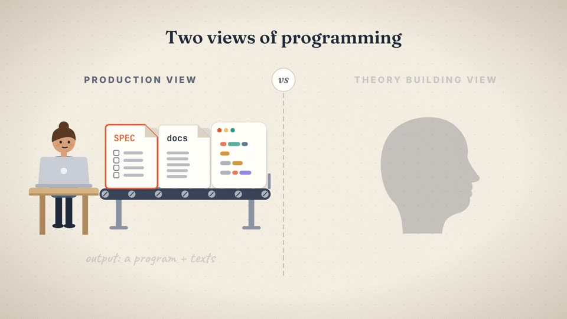

The **production view**: programming produces a program and some other texts.

> 🎙 *He contrasts two views. In the production view, programming produces a program and some other texts.*

### 8. views (0:35.4)

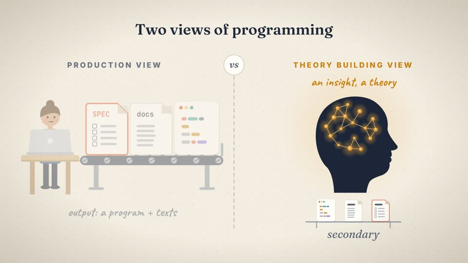

The **theory building view**: programmers form a theory; the texts are *secondary*.

> 🎙 *In the theory building view, programmers form an insight, a theory, of the matters at hand. The texts are secondary.*

### 9. matching (0:41.5)

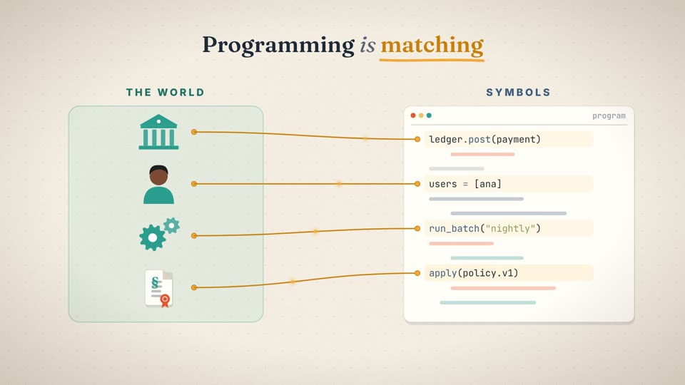

Programming **matches** part of a real-world activity to symbol manipulation.

> 🎙 *Programming, for Naur, is matching part of a real-world activity to what a computer can do with symbols.*

### 10. matching (0:46.2)

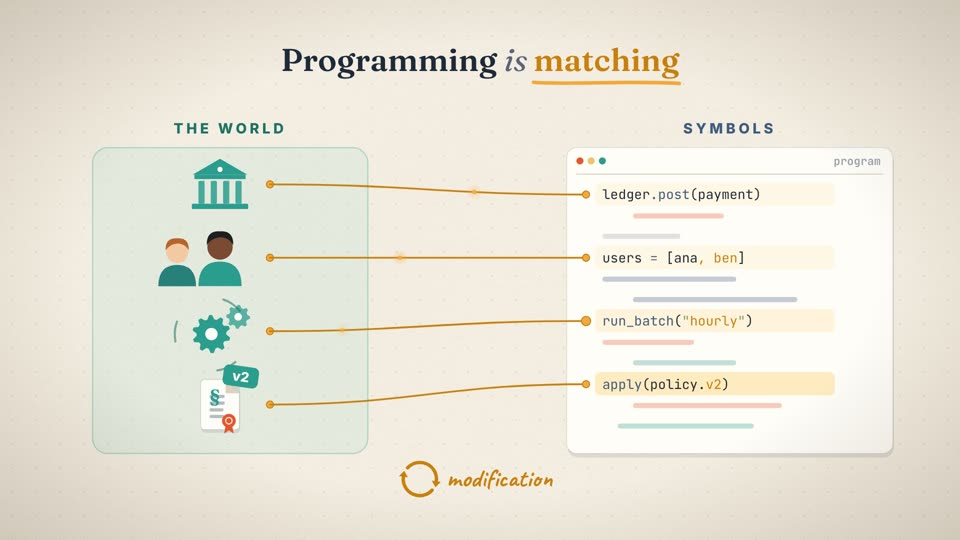

The world changes, so programming includes **modification** to keep the match.

> 🎙 *And since the world keeps changing, it includes modifying the program to keep up.*

### 11. compiler (0:54.6)

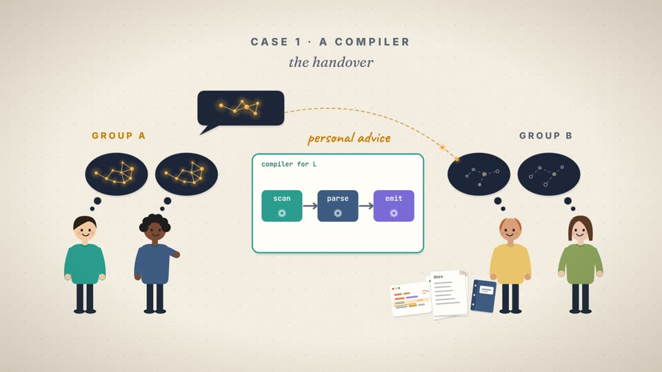

Case 1: group B gets the compiler with full documentation, annotated code and **advice**.

> 🎙 *A team extended another group's compiler, with full documentation, annotated code, and advice from its authors. Still, several of their proposals were patches that would have destroyed its power and simplicity. The authors saw it instantly.*

### 12. compiler (1:02.0)

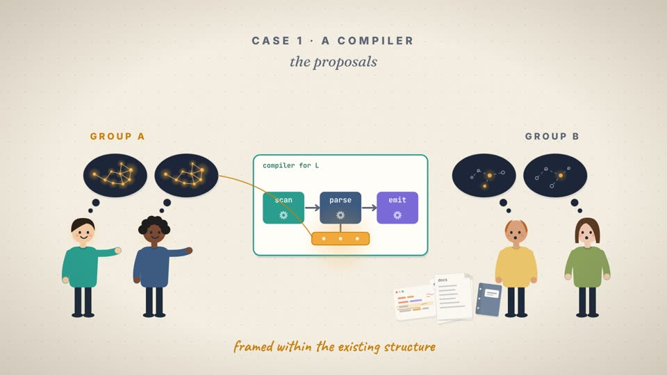

B's proposals are patches that would destroy the design; group A **spots them instantly**.

> 🎙 *Still, several of their proposals were patches that would have destroyed its power and simplicity. The authors saw it instantly.*

### 13. compiler (1:08.3)

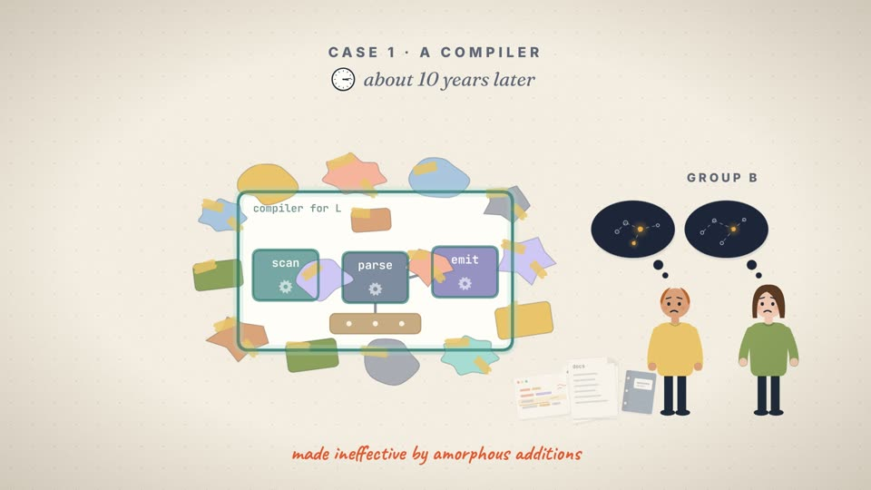

Ten years on, without A: the structure is still visible but **made ineffective** by amorphous additions.

> 🎙 *Ten years on, without them, the structure was still visible, but made ineffective by amorphous additions.*

### 14. monitor (1:17.5)

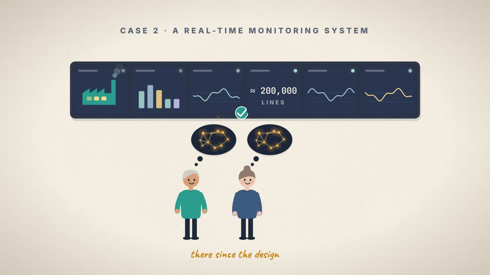

Case 2: the veterans fix faults from **what they know** and the annotated code.

> 🎙 *Second case: a two-hundred-thousand-line monitoring system. The programmers who'd been there since its design fixed faults from what they knew and the annotated code, and couldn't imagine any further documentation that would help.*

### 15. monitor (1:27.4)

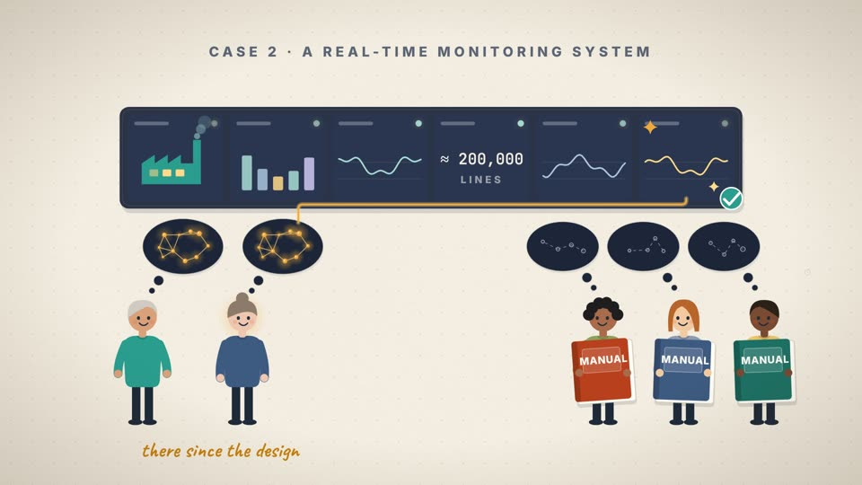

Teams with full manuals get stuck; a veteran **clears it up easily**.

> 🎙 *Teams with full manuals kept getting stuck on problems the veterans cleared up easily.*

### 16. ryle (1:38.6)

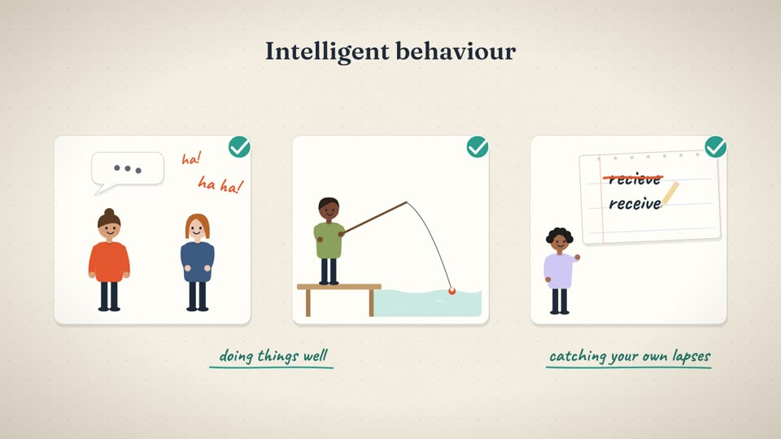

Gilbert Ryle: intelligent behaviour means **doing things well** and **catching your own lapses**.

> 🎙 *Intelligent behavior, like telling jokes or fishing, means doing things well and catching your own lapses.*

### 17. ryle (1:43.6)

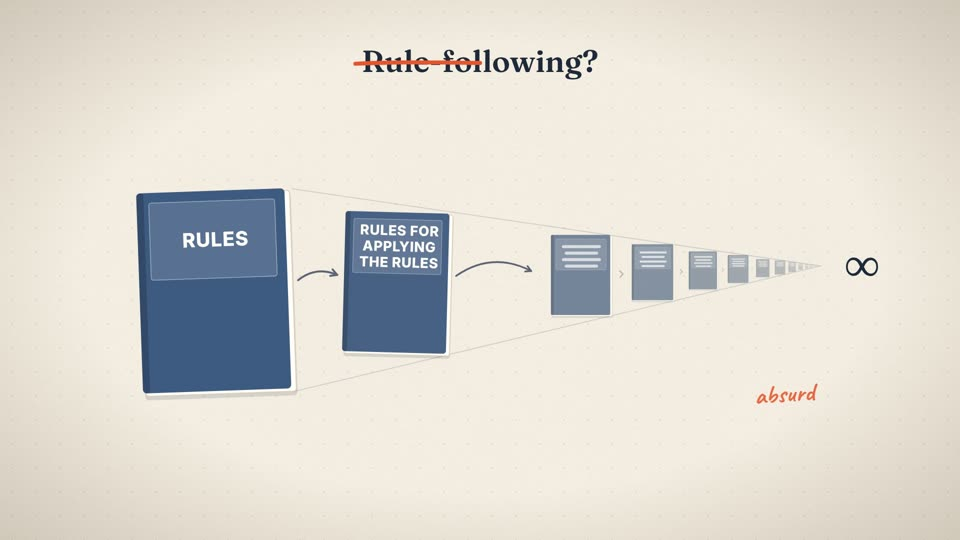

Not rule-following: rules for applying the rules would **regress forever**.

> 🎙 *It isn't rule-following, or you'd need rules for applying the rules, and so on forever.*

### 18. ryle (1:49.5)

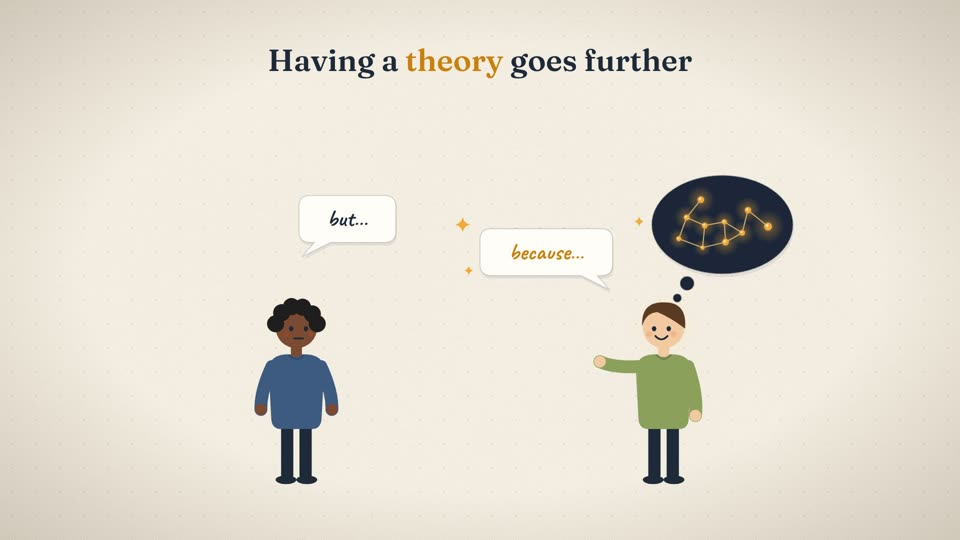

Having a **theory** goes further: explain, answer questions, argue.

> 🎙 *Having a theory goes further: you can explain what you do, answer questions, and argue about it.*

### 19. newton (1:58.2)

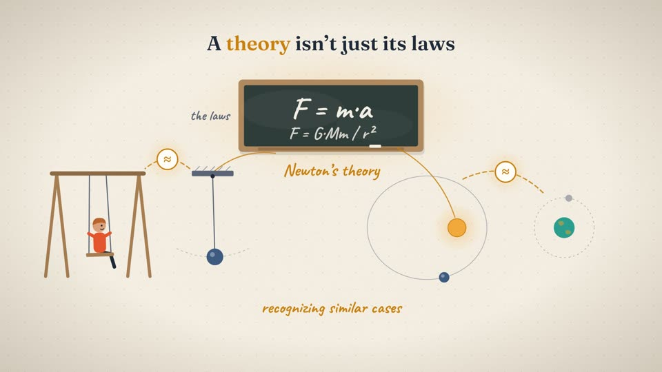

Newton's theory means seeing it in **pendulums and planets**, and recognizing **similar cases**.

> 🎙 *A theory isn't just its laws. Having Newton's theory means seeing how it applies to pendulums and planets, and recognizing similar cases.*

### 20. newton (2:05.4)

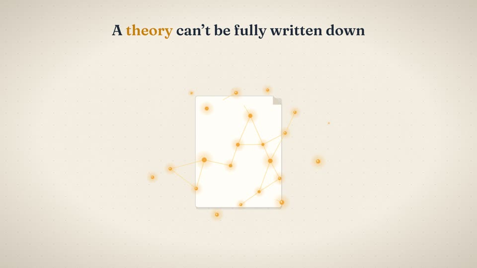

Similarity can't be put into rules, so **a theory can't be fully written down**.

> 🎙 *That kind of similarity can't be put into rules, any more than the likeness of faces or tunes. So a theory can't be fully written down.*

### 21. abilities (2:19.0)

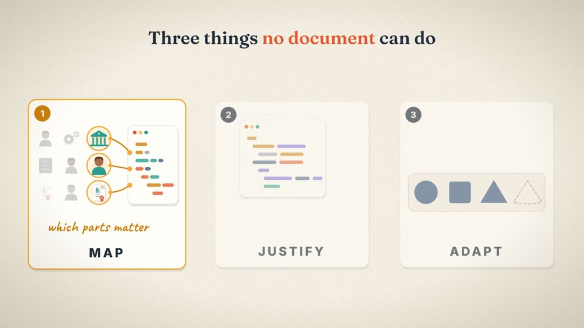

What the theory makes possible, 1: **map** each part to the world, including which parts matter.

> 🎙 *Explain how each part maps to the world, including which parts of the world matter at all.*

### 22. abilities (2:26.3)

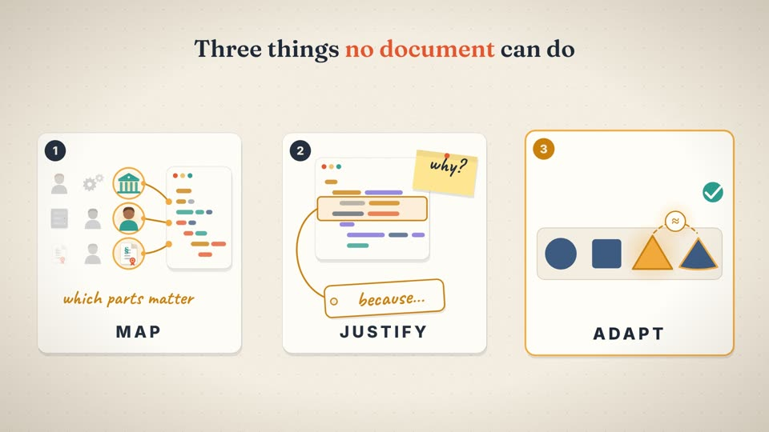

2 **justify** and 3 **adapt**: meet a change by seeing how it resembles what's there.

> 🎙 *Justify why each part is as it is. And meet a request for change by seeing how it resembles what's already there.*

### 23. cost (2:36.3)

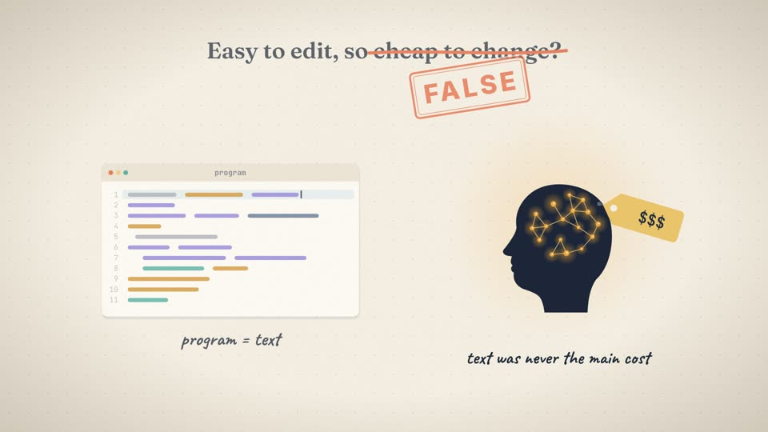

Cheap to edit, so cheap to change? Naur: **false**. Text was never the main cost.

> 🎙 *We expect change to be cheap because a program is text, and text is easy to edit. Naur calls that argument false: text was never the main cost.*

### 24. cost (2:42.8)

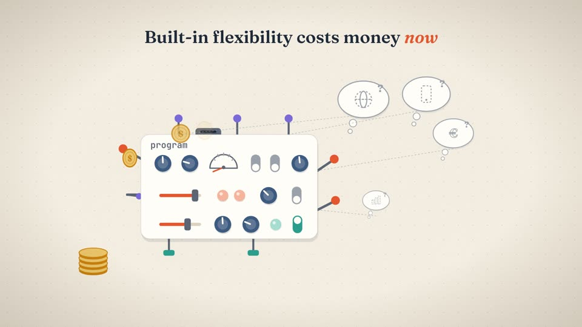

Renovating can cost more than rebuilding, and **flexibility costs now** for needs that may never come.

> 🎙 *Altering a building can cost more than rebuilding it. And built-in flexibility costs money now, for needs that may never come.*

### 25. decay (2:52.5)

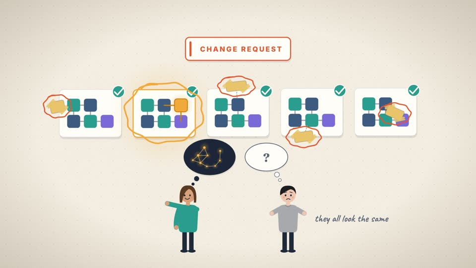

Many ways, all correct: some **extend the theory**, others are **patches**, and only a theory-holder can tell.

> 🎙 *Any change can be made many ways, all correct. Some extend the theory. Others are patches. Only someone with the theory can tell which. That's how programs decay.*

### 26. decay (2:59.9)

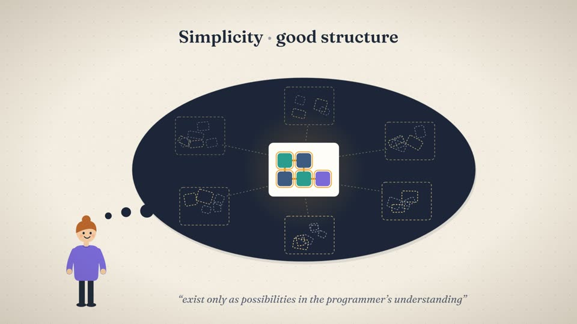

Simplicity and good structure make sense only against the programs that **could have been written**.

> 🎙 *Even simplicity and good structure only make sense against the programs that could have been written instead.*

### 27. life (3:06.0)

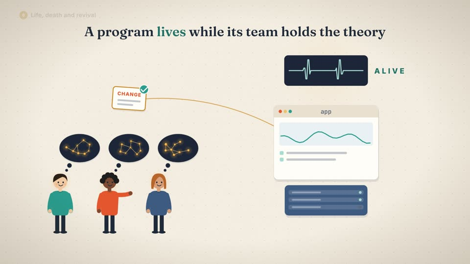

A program is **alive** while a team holding its theory controls its changes.

> 🎙 *So a program is alive while a team holding its theory controls its changes. It dies when that team dissolves, even if it keeps running. The death shows when requests for change can't be answered intelligently.*

### 28. life (3:12.2)

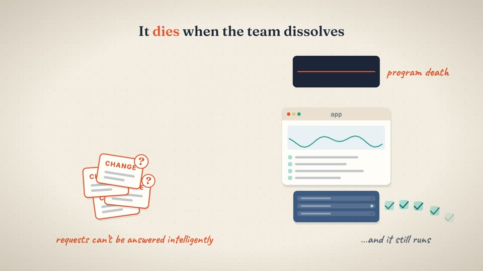

The team dissolves: the program **dies**, keeps running, and requests go unanswered.

> 🎙 *It dies when that team dissolves, even if it keeps running. The death shows when requests for change can't be answered intelligently.*

### 29. revival (3:20.6)

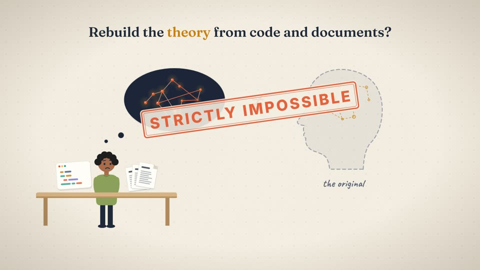

Rebuilding the theory from code and documents alone: **strictly impossible**.

> 🎙 *Rebuilding the theory from code and documents alone is, Naur says, strictly impossible. He'd rather a new team solved the problem afresh.*

### 30. revival (3:28.0)

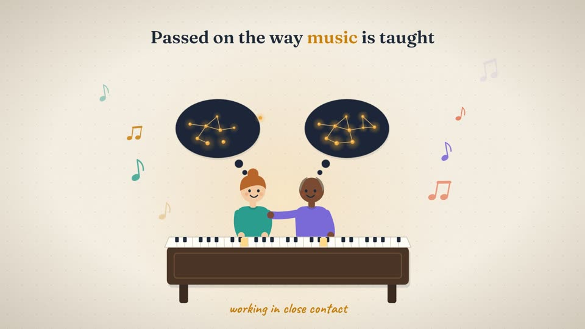

A theory is passed on like music: by **working closely** with people who have it.

> 🎙 *A theory is passed on the way music is taught: by working closely with people who have it.*

### 31. method (3:37.8)

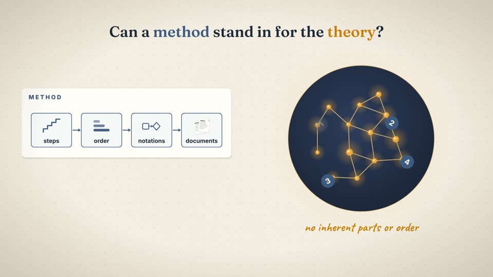

A method is work rules, but a theory has **no inherent parts or order**.

> 🎙 *Can a method stand in for it? A method is a set of work rules: steps, order, notations, documents. But a theory has no inherent parts or order. So there is no right method, though methods help as education.*

### 32. method (3:41.6)

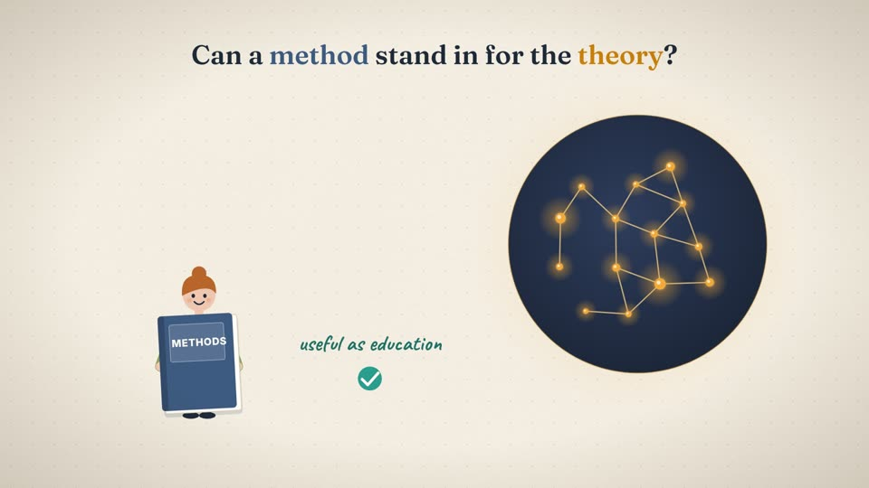

**No right method**; methods help as education.

> 🎙 *But a theory has no inherent parts or order. So there is no right method, though methods help as education.*

### 33. status (3:52.4)

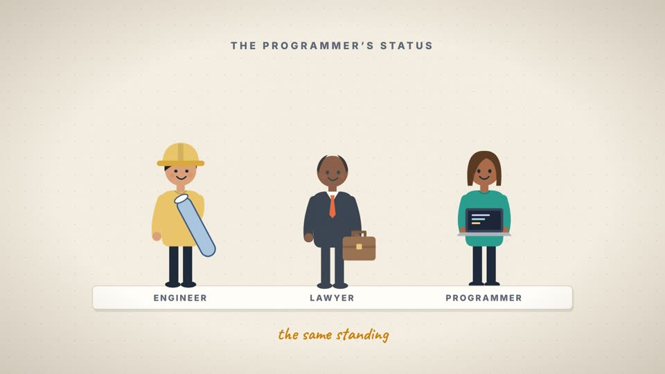

Not replaceable parts: **responsible, permanent developers**, with the standing of engineers and lawyers.

> 🎙 *And programmers aren't replaceable parts on a production line. They're responsible, permanent developers of the activity the computer is part of, with the standing of engineers and lawyers.*

### 34. agents (4:02.4)

Agents make text nearly free. The cost **moves to specifying**.

> 🎙 *Now agents write the code, and text really is nearly free. On Naur's argument, the cost hasn't gone. It has moved to specifying. An agent dropped into a codebase with only code and documents is attempting what Naur called revival. Its picture of the system can differ from the original.*

### 35. agents (4:11.6)

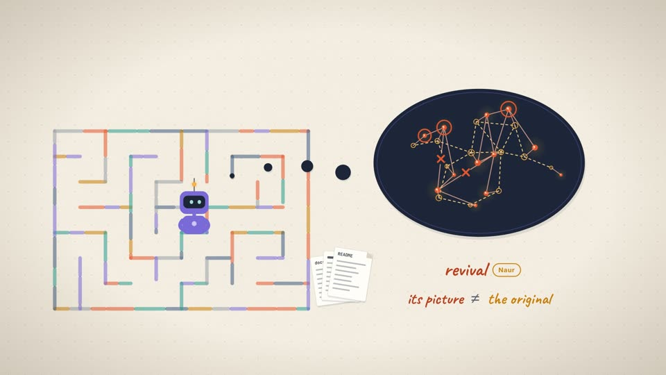

An agent in a codebase is attempting **revival**: its picture differs from the original.

> 🎙 *An agent dropped into a codebase with only code and documents is attempting what Naur called revival. Its picture of the system can differ from the original.*

### 36. agents (4:19.4)

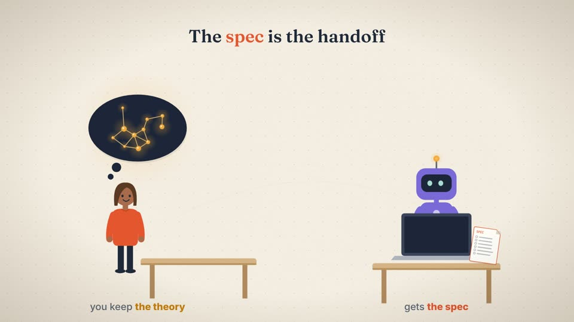

The spec is the handoff. The agent **gets the spec**; **you keep the theory**.

> 🎙 *So the spec is the handoff, and writing it is where the theory gets built. The agent gets the spec. You keep the theory.*

### 37. enterprise (4:31.4)

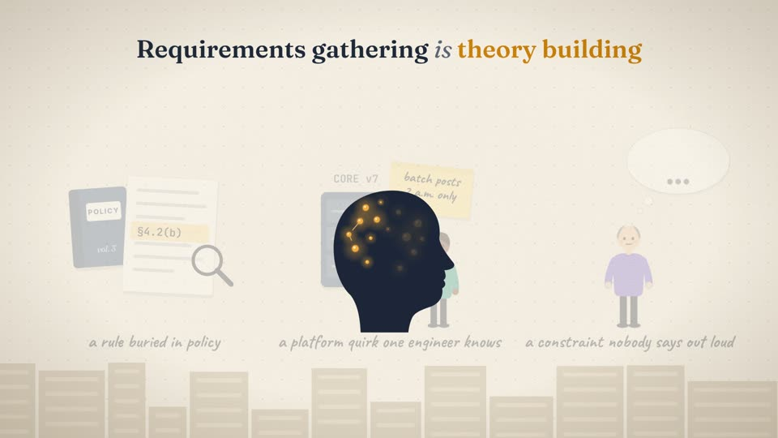

In a regulated enterprise the theory is scattered. **Requirements gathering is theory building.**

> 🎙 *In a regulated enterprise, that theory is scattered: a rule buried in policy, a platform quirk one engineer knows, a constraint nobody says out loud. Requirements gathering is theory building.*

### 38. scratch (4:40.3)

Starting each spec from scratch, every team rediscovers the **same rules, quirks and owners**.

> 🎙 *But if each spec starts from scratch, each team rediscovers the same rules, quirks and owners. Longer documents won't fix that. A loop will.*

### 39. loop (4:55.1)

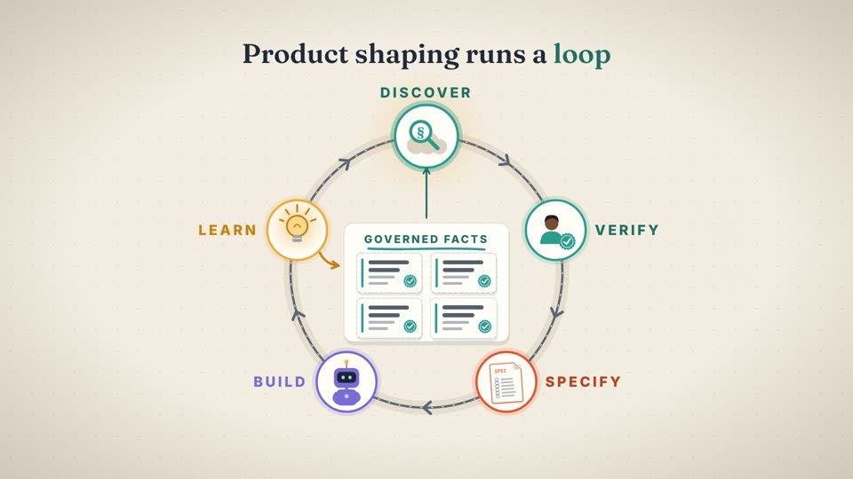

The loop: discover, verify, specify, build, learn, then **write back governed facts**.

> 🎙 *Then it writes back what it learned, as governed facts.*

### 40. governed (5:05.2)

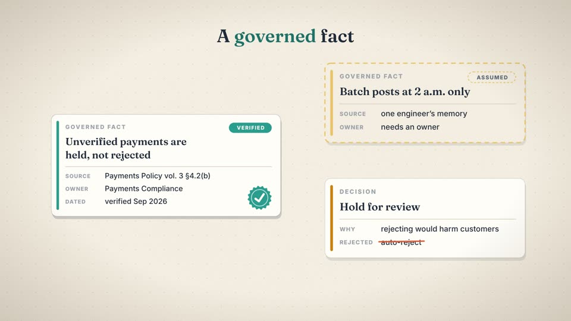

A governed fact: **source, owner, date, verified or assumed**. Decisions keep their reasons.

> 🎙 *A governed fact cites its source, names an owner who vouches for it, carries a date, and says whether it's verified or still assumed. Decisions keep their reasons.*

### 41. compound (5:14.3)

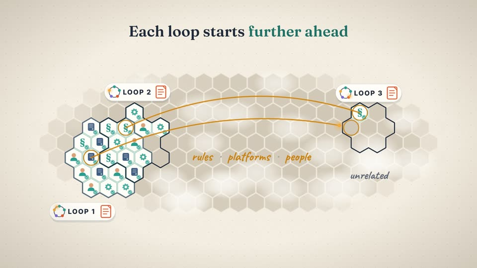

The next loop **starts from those facts**: adjacent work inherits them; unrelated work reuses shared rules, platforms and people.

> 🎙 *The next loop starts from those facts. An adjacent feature inherits most of them. An unrelated one still reuses the rules, platforms and people they share.*

### 42. compound (5:25.8)

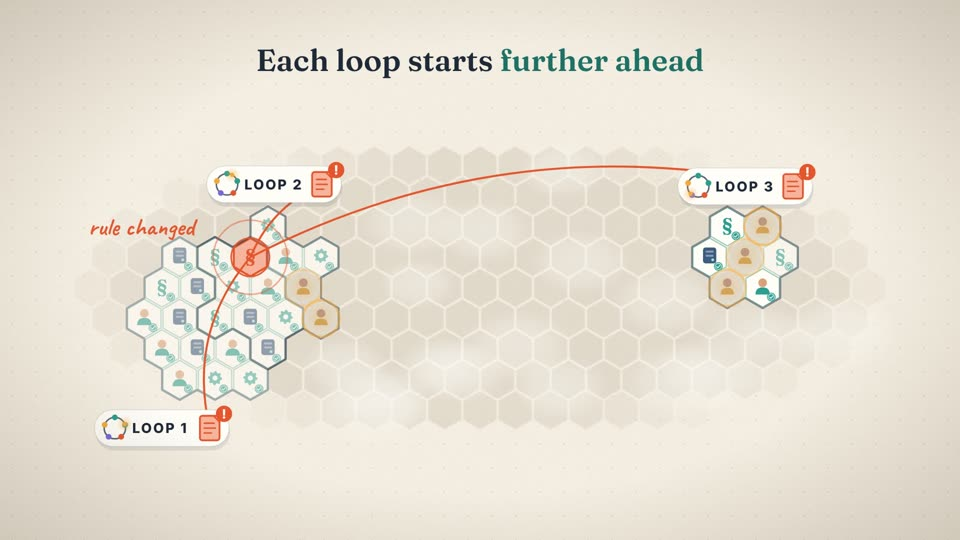

Fewer unknowns, faster loops, and when a rule changes, **every spec that relied on it** lights up.

> 🎙 *And when a rule changes, you can see every spec that relied on it.*

### 43. naurloop (5:38.0)

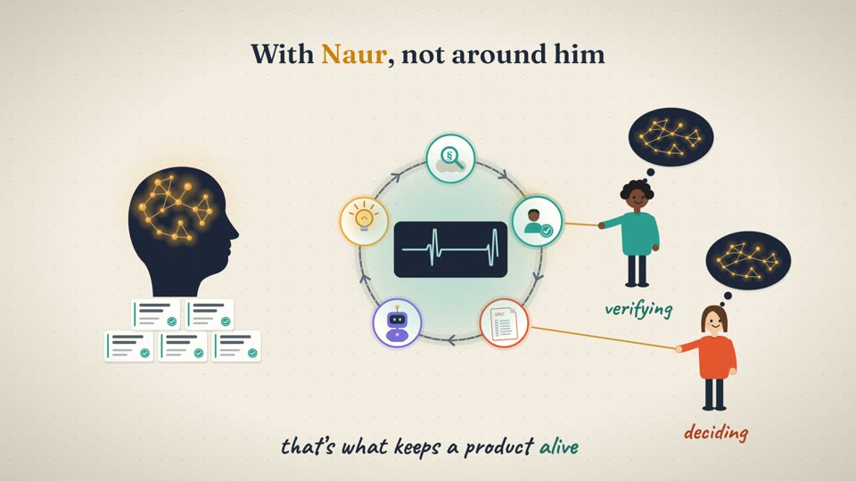

With Naur, not around him: facts are what the theory is built on, and its **holders stay in the loop**.

> 🎙 *And the loop keeps the people who hold the theory in it, verifying and deciding. That's what keeps a product alive.*

### 44. takeaways (5:52.9)

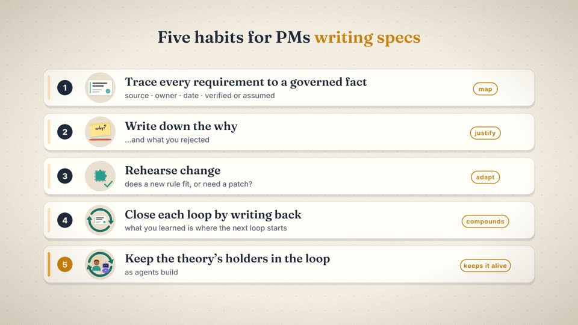

**Five habits** for PMs writing specs.

> 🎙 *Close each loop by writing back what you learned. And keep the theory's holders in the loop as agents build.*

### 45. close (6:00.4)

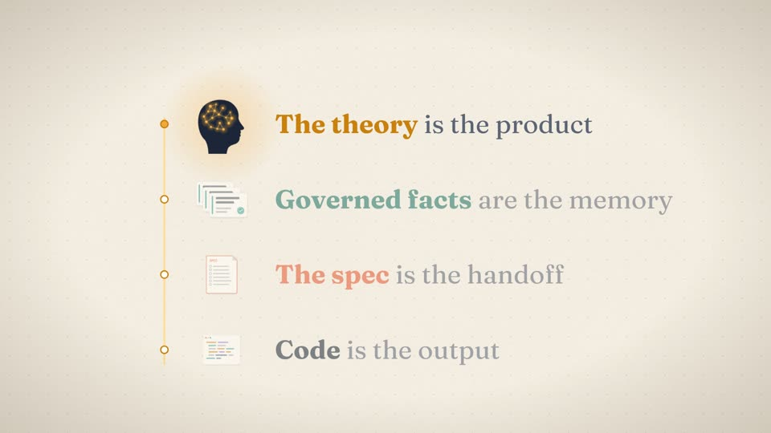

Code is the output. The spec is the handoff. **Governed facts are the memory. The theory is the product.**

> 🎙 *Code is the output. The spec is the handoff. Governed facts are the memory. The theory is the product.*

---

**Visual language.** Warm paper, ink-navy line art and three accent colours. Gold means *theory* (the constellation), coral means *the spec and critique marks*, and teal means *the world*. Type is Fraunces for statements, Inter for labels and Caveat for handwritten asides. The recurring motif is the theory drawn as a constellation. It lives inside people's heads, it can't be copied across with documents, and it glows wherever a human really understands the system.
